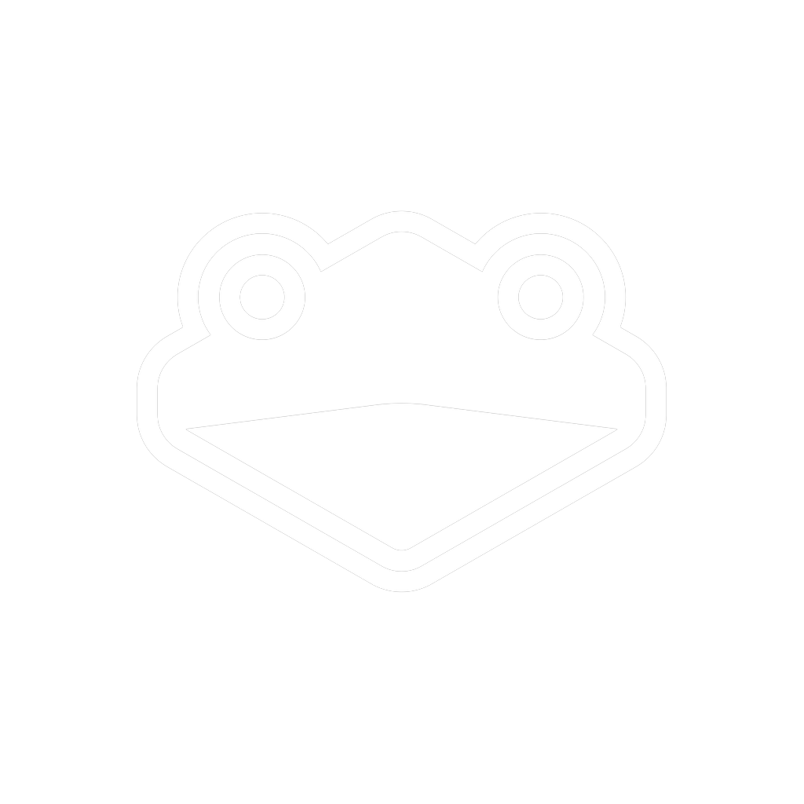
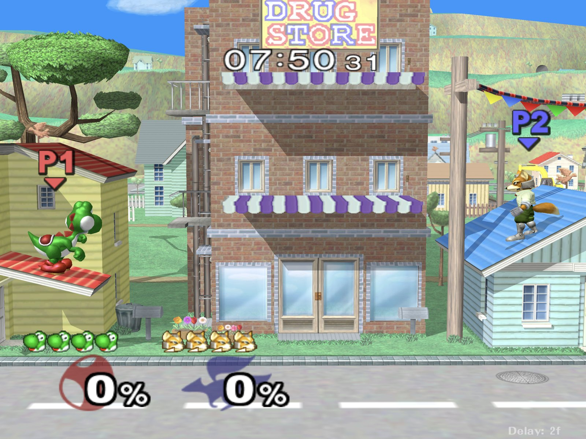
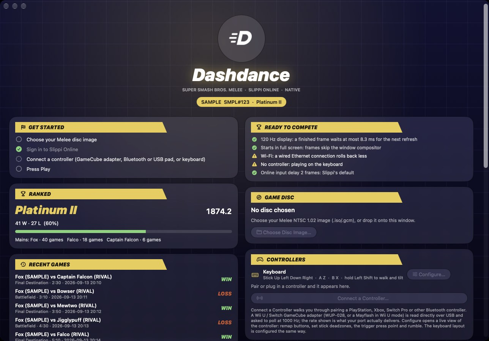
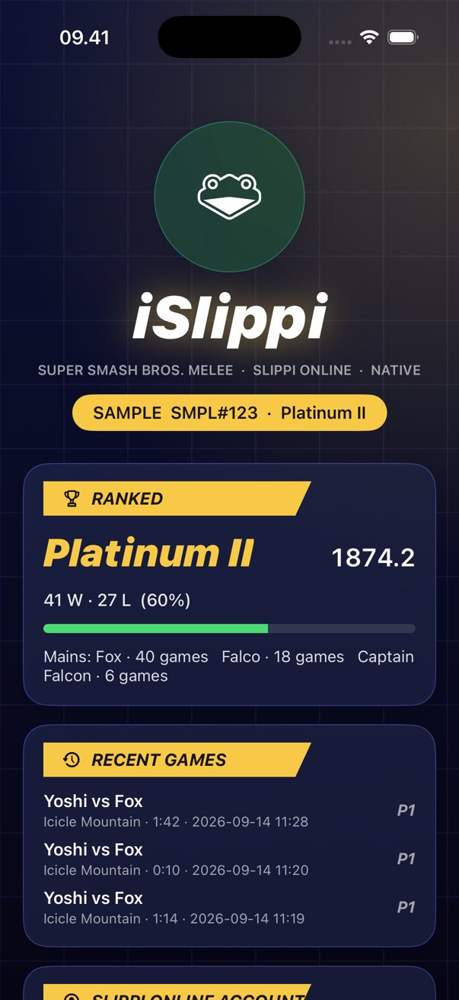
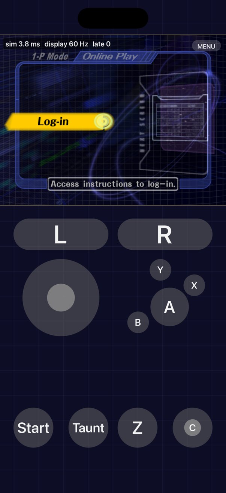

<div align="center">



# iSlippi

### Melee. Slippi. Native on Mac.

No emulator. Just the game, running on Apple silicon.



<sub>Captured full screen on a MacBook Pro with M5 Pro. iSlippi is an unofficial community app. It is not affiliated with or endorsed by the Slippi team or Nintendo.</sub>

</div>

<br>

## Not emulated. Native.

Every other way to play Melee on a Mac runs a GameCube in software, one instruction at a time. iSlippi leaves the console out. Melee is translated once, ahead of time, into native code for Apple silicon and drawn with Metal. What's left is Melee and Slippi, running as a real Mac app.

<div align="center">

| **About 10 ms** | **1000 Hz** | **Zero** |
|:---:|:---:|:---:|
| from a finished frame to your screen, in full screen on a 120 Hz MacBook Pro | GameCube adapter polling, with no driver and no security changes | late frames in a minute of play on six of the seven stages we measured |

</div>

## Every frame, right on time.

- **Straight to the screen.** A finished frame reaches the display in about 10 ms in full screen. On a ProMotion display, it's shown on the very next refresh.
- **Your inputs, read last.** Controllers are read right before each frame starts, not a frame early.
- **Nothing in the way.** Game Mode, performance cores and a real-time game thread keep background work from stealing a frame.
- **No stutter on a new stage.** Graphics are prepared in the background and remembered, so a stage you've seen never hitches again.

## Your Slippi, built in.

Sign in with your Slippi account right in the app. No launcher, no Dolphin. Your rank, rating, record and recent games are waiting on the dashboard, and your rank sits in the Mac's menu bar. iSlippi speaks Slippi's own netcode, so you're matched with the same players you'd meet on Slippi Dolphin.

<div align="center">

&nbsp;

<br><sub>Shown with sample data.</sub>
</div>

## Your controller. Your way.

- **GameCube controllers at 1000 Hz.** Plug in a GameCube adapter for Wii U and Switch, or a Mayflash in Wii U mode. iSlippi reads it directly at 1000 Hz. That used to take a driver and a trip to Recovery mode.
- **Connect a Controller.** PlayStation, Xbox, Switch Pro and more. Pick yours, follow three short steps, and iSlippi tells you the moment it's connected.
- **Make it yours.** A live controller lights up as you press. Remap any button, set your deadzones and trigger press point, and turn rumble on or off. Your keyboard works too.

<div align="center">

&nbsp;

</div>

## Settings, mid-match.

Hold **L + R + Start**, or press **F1**. Change resolution, display sync, volume and controls, or turn on a live performance readout, all without leaving the game.

<div align="center">

</div>

## Take it with you.

iSlippi also runs on iPhone, iPad and Apple Vision Pro. The touch controls feel like a GameCube controller, and they step aside the moment you connect a real one. Every screen fits the device you're holding, in portrait or landscape.

**Fast on the go, too.** While you play, iSlippi keeps the display at its highest refresh rate, trims audio delay, and lets you choose Slippi's online input delay yourself. A **Ready to compete** check on the dashboard tells you, in plain words, what in your setup is costing you milliseconds: the display, Wi-Fi instead of a cable, a slow controller, Low Power Mode or Bluetooth headphones.

**Ready for iPhone Duo.** iSlippi follows Apple's iPhone Duo design guidelines. Hold it upright and the game sits above the fold with the controls below it. The dashboard splits into two columns around the fold when there's room. Controls and text stay the same size on both displays. And the space around the picture shows Melee's grid instead of black bars.

<div align="center">

&nbsp;

&nbsp;

</div>

## Get iSlippi.

**You'll need:**

- A Mac with Apple silicon (M1 or newer).
- Your own copy of Super Smash Bros. Melee (NTSC 1.02) as a disc image. iSlippi doesn't include the game.
- A free [Slippi account](https://slippi.gg) to play online.

**Install.** Open Terminal: press ⌘ Space, type *Terminal* and press Return. Paste this line and press Return:

```bash
curl -fsSL https://raw.githubusercontent.com/TheAndersMadsen/islippi/main/install.sh | zsh
```

When it asks, drag your Melee disc image into the Terminal window and press Return. iSlippi builds itself on your Mac from your own disc, which takes ten to fifteen minutes the first time. Then it's in your Applications folder, and it opens.

To update, paste the same line again.

**On iPhone or iPad.** iSlippi can't be on the App Store, because it's built from your own disc. You can still put it on your own device with AltStore, SideStore or Sideloadly. For iPhone Duo, build with Xcode 27.1 or later so it fills both displays. [See how](docs/TECHNICAL.md#iphone-and-ipad-your-own-device).

## Questions.

**Is this official?**
No. iSlippi is a community project. It isn't made, endorsed or supported by the Slippi team or Nintendo.

**Can I just download the app?**
No, and there never will be a download. The finished app contains Melee's code, so it has to be built from your own disc, on your own Mac.

**Can I play people who use Slippi Dolphin?**
Yes. iSlippi uses Slippi's own matchmaking and netcode.

**Does it change anything on my Mac?**
It installs Apple's developer tools and a few build tools, then builds the app. It doesn't install drivers or change your Mac's security settings.

**Something isn't working.**
iSlippi is still in alpha. Please [open an issue](https://github.com/TheAndersMadsen/islippi/issues) and tell us what happened.

## For developers.

How it works, the latency work, controller and adapter internals, device builds and building from source are all in the [technical guide](docs/TECHNICAL.md). Measurements are in [PERFORMANCE.md](docs/PERFORMANCE.md), and contributors and coding agents should start with [CLAUDE.md](CLAUDE.md).

## Credits and legal.

Built on the work of the [Slippi](https://slippi.gg) team, the [Dolphin](https://dolphin-emu.org) project, [SDL](https://libsdl.org), [Aurora](https://github.com/encounter/aurora), the [doldecomp/melee](https://github.com/doldecomp/melee) contributors, and [Hero88go/melee-unlocked](https://github.com/Hero88go/melee-unlocked), the Windows build this project tracks.

The GameCube controller in the controller editor is the indigo controller from [ControllerOverlays](https://github.com/datkat21/ControllerOverlays) by Kat21, licensed GPL-3.0 (see [its notes](port/app/art/controller/README.md)). Builds that include it are distributed under GPL-3.0, which the project's GPL-2.0-or-later licence allows. The app icon and dashboard mark use the Slippi logo from the [Slippi Launcher](https://github.com/project-slippi/slippi-launcher) (GPL-3.0). Slippi is a trademark of its authors, and the logo identifies what the app connects to, not an affiliation. Design references: [dimillian/Skills](https://github.com/dimillian/Skills), Apple's Human Interface Guidelines, including [Designing for iPhone Duo](https://developer.apple.com/design/human-interface-guidelines/designing-for-iphone-duo), and [PwrGit](https://github.com/pwrdrvr/PwrGit/pull/196) for the Icon Composer layout.

iSlippi is licensed GPL-2.0-or-later. Super Smash Bros. Melee is the property of Nintendo and HAL Laboratory. This repository contains no game data. You must supply your own legally obtained disc image. iSlippi is not affiliated with or endorsed by the Slippi team, Nintendo or HAL Laboratory.
