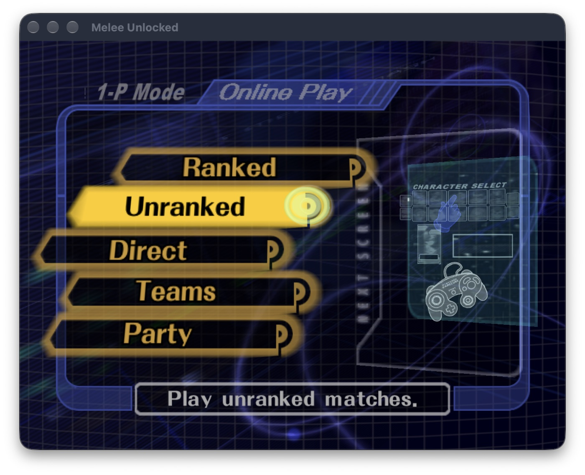

<div align="center">

# Melee Unlocked for Apple

### Super Smash Bros. Melee. Slippi Online. Native on your Mac.

No emulator. No Dolphin. The game itself, translated ahead of time into native Apple Silicon code and rendered with Metal — with Slippi's matchmaking, rollback netcode and replays built in.


<sub>Real capture from an Apple M5 Pro running macOS 27. Nothing from the game is included in this repository — you bring your own disc image.</sub>

<br>


</div>

---

## Why this exists

Melee has always been an emulated game on the Mac: a PowerPC console, simulated instruction by instruction, with the netcode bolted onto the emulator. This project takes the other road.

- **It is the real game.** The original executable and Slippi's code patches are translated once, ahead of time, into ordinary native code. Nothing is interpreted while you play.
- **It is Slippi.** Matchmaking, the rollback netcode, replays and game reporting are ports of Slippi's own open-source code. You play Unranked, Direct and Teams against people on regular Slippi Dolphin, and they never know the difference.
- **It is a Mac app.** Metal rendering, native audio, your keyboard, any SDL-compatible controller, and the official GameCube adapter over USB.

<div align="center">
&nbsp;

</div>

## Get playing

You need an Apple Silicon Mac, your own **Super Smash Bros. Melee NTSC 1.02** disc image (`.iso` or `.gcm`), and, for online play, the [Slippi Launcher](https://slippi.gg/downloads) signed in once.

1. **Build the app** (about ten minutes the first time — see [Build from source](#build-from-source)).
2. **Open Melee Unlocked.** Pick your disc image when asked. The app remembers it.
3. **Play.** Online Play uses the account you signed into in the Slippi Launcher automatically.

### Controls

| GameCube | Keyboard |
|---|---|
| Control stick | Arrow keys |
| C-stick | I J K L |
| A / B / X / Y | Z / X / C / V |
| L / R / Z | Q / W / E |
| D-pad | T F G H |
| Start | Return |

Any controller SDL recognises works out of the box. A WUP-028 GameCube adapter takes priority on the ports it has controllers plugged into.

## Where it stands

| | Status |
|---|---|
| Boot, menus, offline VS matches | ✅ Working |
| Slippi Online: login, matchmaking, rollback, replays | ✅ Working — verified with two local instances staying in sync for a full game |
| Audio, keyboard, gamepads, GameCube adapter | ✅ Working |
| Memory card saves (`.gci` folder) | ✅ Working |
| Rendering | ✅ Native Metal renderer with the same Dolphin-derived shader pipeline as the Windows build, at up to 8× internal resolution |
| iPhone / iPad | 🚧 In progress |
| Apple Vision Pro | 🚧 In progress |

This is an alpha. Expect rough edges, and please report them.

<div align="center">

<br><sub>Two instances of the app in an online match against each other on one Mac.</sub>
</div>

## How it works

1. **Translate.** `port/recomp` reads your disc's executable and Slippi's Gecko code tables and writes one C++ function per game function. Apple Clang compiles them into a static library. This step runs on your machine; nothing from the game is ever committed here.
2. **Run.** `port/runtime` is the host: guest memory, the GameCube SDK services the game expects (disc, controllers, audio DSP, memory cards), and the Slippi EXI device that Slippi's code talks to.
3. **Draw.** The game's GX commands are decoded into draw calls and rendered by a native Metal backend (`port/runtime/gx/gx_metal.mm`) with shaders generated the way Dolphin generates them, so what you see matches the Windows build.
4. **Connect.** `slippi_net` and `slippi_online` are wire-compatible ports of Slippi Dolphin's netplay client, matchmaking and reporting.

## Build from source

Requirements: Xcode Command Line Tools, Homebrew (`cmake ninja python libusb`), a checkout of [doldecomp/melee](https://github.com/doldecomp/melee) for the animation helpers, and your disc's `main.dol`.

```bash
git clone https://github.com/TheAndersMadsen/melee-slippi-native.git
cd melee-slippi-native
tools/bootstrap_aurora.sh
python3 tools/bootstrap_port.py --decomp-root /path/to/doldecomp-melee \
  --dol /path/to/main.dol --build-dir build/mac --gct-base 0x8065CC80 --macos-arch arm64 --stage generate
cmake -S . -B build/mac -G Ninja -DCMAKE_BUILD_TYPE=Release \
  -DMELEE_DECOMP_ROOT=/path/to/doldecomp-melee -DMELEE_DOL_PATH=/path/to/main.dol \
  -DMELEE_PORT_GENERATED_DIR=$PWD/build/mac/generated/guest \
  -DMELEE_BUILD_PORT_TESTS=ON -DMELEE_BUILD_PORT_HEADLESS=ON -DMELEE_BUILD_PORT_METAL=ON
cmake --build build/mac --target melee_port_mac --parallel
tools/package_macos_app.sh build/mac dist
open "dist/Melee Unlocked.app"
```

`melee_port_mac --help` lists every option (window size, volume, input delay, explicit disc or Slippi folder). `melee_port_metal` and `melee_port_headless` are offline diagnostic executables used by the test suite. Developer notes live in [docs/](docs/).

## Windows

The upstream project, [Hero88go/melee-unlocked](https://github.com/Hero88go/melee-unlocked), is the Windows build with D3D12, DLSS and an unlocked display rate. This repository tracks it and adds the Apple platforms.

## Credits and legal

Built on the work of the [Slippi](https://slippi.gg) team, the [Dolphin](https://dolphin-emu.org) project, [SDL](https://libsdl.org), [Aurora](https://github.com/encounter/aurora) (build tooling and the diagnostic renderer), the [doldecomp/melee](https://github.com/doldecomp/melee) contributors, and [Hero88go/melee-unlocked](https://github.com/Hero88go/melee-unlocked). This project is not affiliated with or endorsed by the Slippi team, Nintendo or HAL Laboratory.

GPL-2.0-or-later. Super Smash Bros. Melee is the property of Nintendo and HAL Laboratory. This repository contains no game data; you must supply your own legally obtained disc image.
