# iSlippi technical guide

The [README](../README.md) is the short version for players. This is everything underneath: how the app is built,
what it does for latency and why, the controller and adapter details, device builds and sideloading, and how to build
from source. Contributors and coding agents should also read [CLAUDE.md](../CLAUDE.md).

### iPhone Duo

The app follows Apple's [iPhone Duo guidelines](https://developer.apple.com/design/human-interface-guidelines/designing-for-iphone-duo):

- **One game rectangle for everything** (`host::window_game_rect`). Held upright, the picture sits under the camera and never
  reaches past the middle of the display, so on the inner display the fold falls between the game and the touch controls.
  Sideways, it is centred at full height. The renderer, the touch layout and the letterbox artwork all use it.
- **No bare letterbox.** Melee's 4:3 (or 16:9) picture cannot change its aspect ratio, so the padding carries Melee's menu grid,
  centred on the display so it is symmetric about the fold, with a thin yellow keyline around the picture.
- **Same sizes on both displays.** Touch-control clusters are capped at 440 pt tall and sit low, within thumb reach; the in-game
  menu uses 18 pt lines and every overlay string shrinks to fit its box instead of overflowing.
- **Size classes, not devices.** The dashboard switches to two columns in a regular-width environment at least 800 pt wide and
  centres the columns on the display, not the safe area, so the gap between them sits on the fold even when system controls run
  along one edge. The controller editor goes side by side in landscape. Nothing reads a global main screen.
- **Text always fits.** `MELEE_TEXT_AUDIT=1` (Mac, iPhone, iPad, Vision Pro) logs any text that is clipped, overflows its window or crowds the rounded ends of its capsule; the in-game overlay shrinks lines to fit instead. It found the clipped player badge and a squeezed Configure button on iPhone, both fixed.
- **Resizable.** `UIRequiresFullScreen` is off, so the app works in Split View on the inner display and in iPadOS windows.
- **SDK.** Apps built before the iOS 27.1 SDK run at a smaller compatible size on iPhone Duo. `setup.sh` prints a note when the
  installed Xcode is older; build with Xcode 27.1 or later for the full fit. The reserved-region and hinge APIs (iOS 27.1) are not
  used yet because this tree still builds with the iOS 26 SDK, and nothing has been run on an iPhone Duo or its simulator yet.

### Latency on iPhone, iPad and Vision Pro

What the app does, and what only the player can change:

| | |
|---|---|
| **Online input delay** | Slippi's delay frames are the biggest online latency setting: every frame adds 16.7 ms. The dashboard and the in-game menu offer 1 to 4 (`online_delay` in launcher.ini, 1..9, `--online-delay N`); 2 is Slippi's default. A menu change applies from the next match. 1 is lowest on a stable, nearby connection; on Wi-Fi 2 usually rolls back less. |
| **Display held at full refresh** | While playing, a `CADisplayLink` on its own thread asks for the screen's maximum rate (120 Hz on ProMotion iPhones and iPads). Otherwise the system lowers the panel to 60 Hz for 60 fps content, and a finished frame can wait up to 16.7 ms instead of 8.3 ms. Menus go back to adaptive refresh. |
| **Audio buffer** | The audio session asks for a 5 ms hardware buffer at 48 kHz (iOS defaults to about 20 ms) and for no system-alert interruptions; the log reports what was granted (`audio session: IO buffer ...`). |
| **Honest warnings** | The performance HUD adds "Low Power Mode on" (the system limits the display and the CPU) and "Bluetooth audio lags" (wireless audio trails the picture by far more than any buffer). Both are logged too. |
| **Already in place** | The game thread runs with real-time scheduling, inputs are read right before each frame, the render thread presents on the next refresh with a two-drawable swapchain, netplay sockets use Wi-Fi's voice traffic class, iPhones cap internal resolution at 2x and step down under heat, and Game Mode is declared. |
| **Up to the player** | A USB-C Ethernet adapter beats Wi-Fi for online play. A USB-C controller beats Bluetooth where the device takes one. Turn off Low Power Mode. Use wired or built-in audio. |
| **Ready to compete** | A dashboard card (Mac, iPhone, iPad, Vision Pro) checks the live setup once a second and says, in plain words, what costs latency: display refresh, full screen on the Mac, Low Power Mode, wired versus Wi-Fi versus mobile data (Network framework path monitor), the controller type and its measured report rate, Bluetooth audio, the online delay and heat. The same list is logged as `readiness:` lines when a match starts. |
| **Network threads** | The netplay thread runs at user-interactive QoS and the matchmaking thread at user-initiated, set explicitly, so opponent inputs are handled on performance cores; outgoing pads wake the ENet thread immediately. |
| **Rollback cost** | Save-state capture and load are timed as `savestate` in the frame-timing log, so rollback bookkeeping on a phone is visible next to everything else. |
| **Phase lock stays off** | Measured on an M5 Pro in a scripted match: frame-to-panel latency averaged 3.74 ms with the display phase lock off and 3.69 ms with it on, zero late frames either way. That is noise, so `MELEE_PHASE_LOCK` remains an experiment. |
| **Vision Pro** | The system composites every window at the headset's fixed refresh rate, so there is no refresh to raise; the delay setting, controller and resolution choices still apply. |

None of this has been measured on a physical iPhone, iPad or Vision Pro yet: the Simulator runs on the Mac's GPU at 60 Hz and has no presented-time API. On a device, `MELEE_METAL_LATENCY=1` logs frame-to-panel time.

## Why this exists

Melee has always been an emulated game on the Mac: a PowerPC console, simulated instruction by instruction, with the netcode bolted onto the emulator. This project takes the other road.

- **It is the real game.** The original executable and Slippi's code patches are translated once, ahead of time, into ordinary native code. Nothing is interpreted while you play.
- **It is Slippi.** Matchmaking, the rollback netcode, replays and game reporting are ports of Slippi's own open-source code. You play Unranked, Direct and Teams against people on regular Slippi Dolphin, and they never know the difference.
- **It is a Mac app.** Metal rendering, native audio, your keyboard, any SDL-compatible controller, and the official GameCube adapter over USB.

<div align="center">
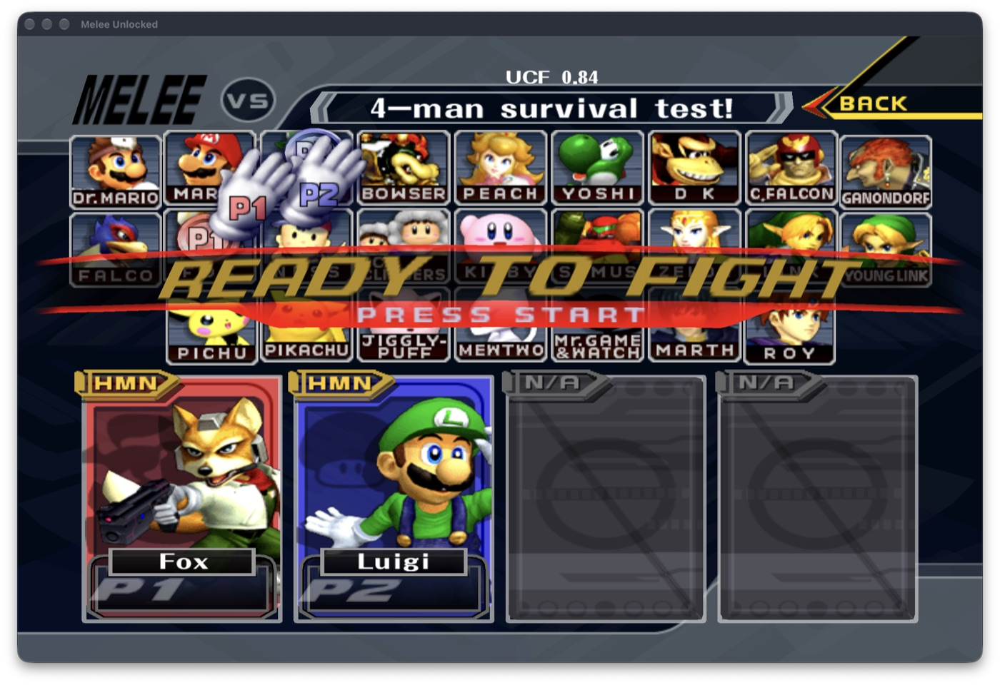&nbsp;
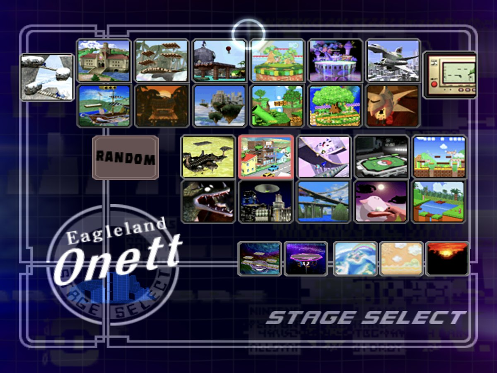
<br><sub>Character and stage select, full screen on a MacBook Pro. UCF and the Slippi netplay code are the real ones from the Slippi Launcher's game files.</sub>
</div>

## Quick start

One command builds and opens the Mac app. It installs the tools it needs, fetches the game's symbol
tables from the open-source decompilation, pulls `main.dol` out of your own disc image and packages
`dist/iSlippi.app`:

```bash
git clone https://github.com/TheAndersMadsen/islippi.git && cd islippi
./setup.sh /path/to/melee.iso
```

Add `--ios` or `--visionos` (with Xcode installed) for the iPad, iPhone or Vision Pro Simulator app, or
`--device` for an IPA you sideload onto your own iPhone or iPad (see below).
Coding agents: read [CLAUDE.md](../CLAUDE.md) first; it has the layout, the build rules that bite and the
diagnostics.

## Get playing

You need an Apple Silicon Mac (or an iPad, iPhone or Vision Pro), your own **Super Smash Bros. Melee NTSC 1.02** disc image (`.iso` or `.gcm`), and a free [Slippi account](https://slippi.gg) for online play.

1. **Build the app** (about ten minutes the first time — see [Build from source](#build-from-source)).
2. **Open iSlippi.** The dashboard walks you through it: choose your disc image (on iPad and iPhone, import it or drop it into the app's folder in Files). The app remembers it.
3. **Sign in to Slippi** right there — email and password, no separate app. You stay signed in, and the dashboard shows your ranked tier, rating, record, daily placement, most-played characters and your recent games.
4. **Play.**

<div align="center">
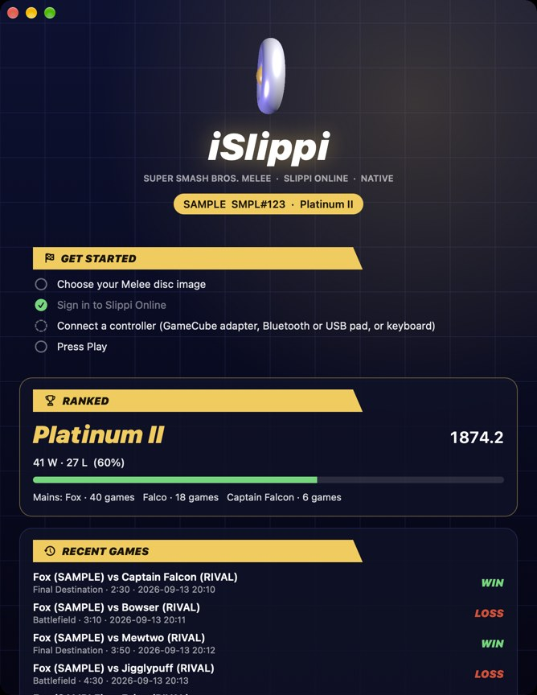
&nbsp;&nbsp;
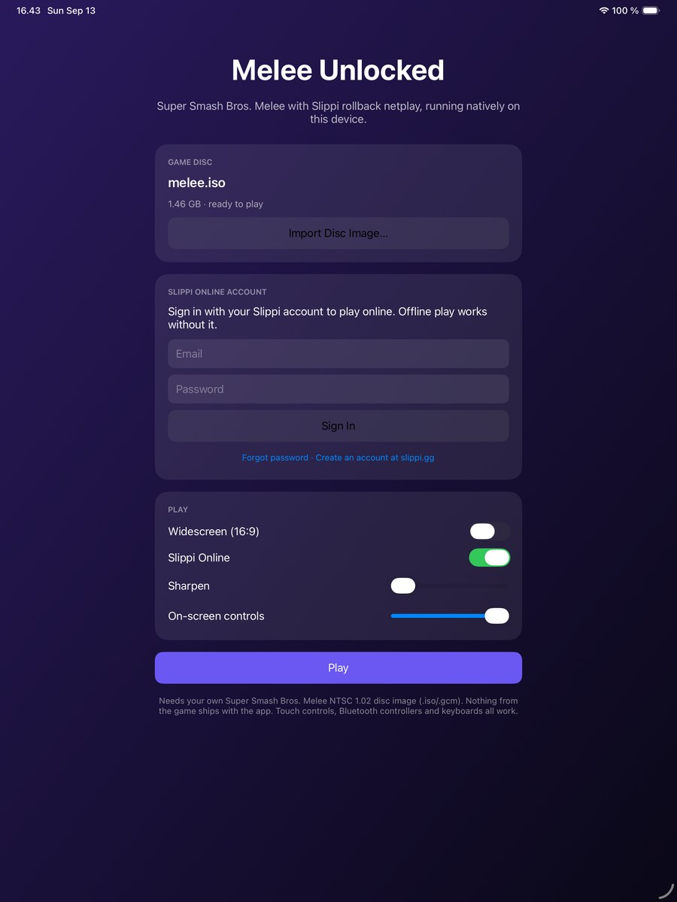
<br><sub>The dashboard on macOS and iPad (shown with sample data). Ranked stats come from Slippi's profile API; recent games are read from your own replays.</sub>
</div>

<div align="center">
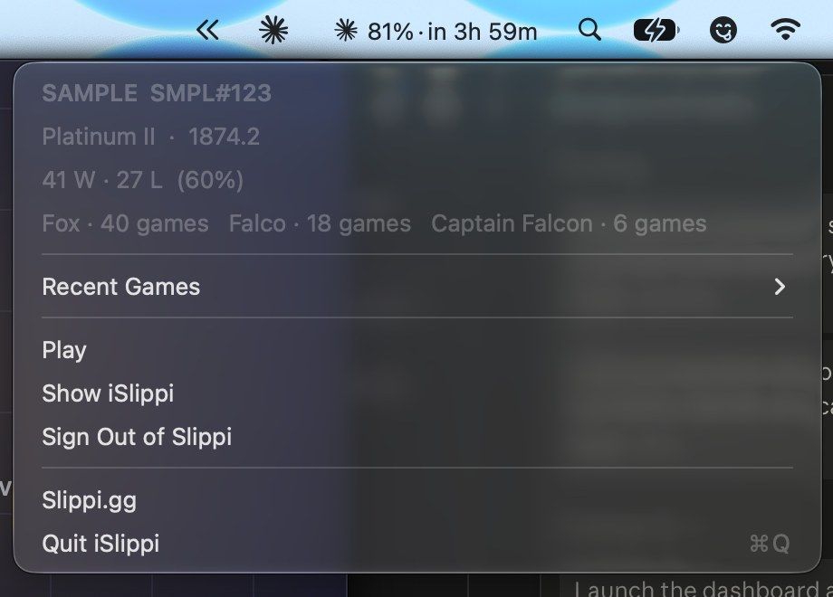
<br><sub>On the Mac the Slippi mark sits in the menu bar with your rank; its menu has your stats and the actions that matter, even mid-game.</sub>
</div>

### Design

The app follows Apple's current design language. On macOS 26 and iOS 26 the dashboard is built from real Liquid Glass: `NSGlassEffectView` and `UIGlassEffect` cards inside a glass container (so neighbouring glass merges and renders in one pass), glass buttons with a prominent tinted Play, and a glass disc holding the Slippi mark. Older systems get the same layout on system materials. The app icon is an Icon Composer bundle (`port/app/icons/AppIcon.icon`) compiled by `actool`: the Slippi mark as a glass layer over the Slippi green, so macOS and iOS render it with the system's specular highlights, dark and tinted variants included. Melee's own visual grammar stays: the angled yellow section headers and italic display type are the game's menu style. Haptics are used sparingly (Play, sign-in result), sliders show their values, and the Mac has a real menu bar. Every screen adapts to its space: on a wide Mac window, an iPad in landscape, a 13-inch iPad or a Vision Pro window the dashboard's cards sit in two columns, phones keep one column in portrait and landscape, the controller editor puts the controller next to its settings when there is room, and the touch controls, performance HUD and in-game menu stay clear of the Dynamic Island, rounded corners and home indicator.

### The dashboard

| Card | What it does |
|---|---|
| **Get started** | A checklist that ticks itself off: disc, sign-in, controller, Play. It disappears once you are set up. |
| **Ranked** | Tier (Bronze through Grandmaster, using Slippi's thresholds), rating, wins and losses with a win-rate bar, daily global and regional placement, and your mains by games played. |
| **Recent games** | Your last games parsed from the `.slp` replays the app writes: characters, opponent, stage, duration, and whether you won. |
| **Slippi Online account** | Sign in, sign out, password reset. The session is kept on the device so ranked stats reload on every launch. |
| **Game disc** | Choose or drop the disc image. |
| **Controllers** | Every connected controller and the keyboard, each controller's GameCube port (auto or fixed 1–4), a Configure button that opens the controller editor, and Connect a Controller, which walks you through Bluetooth pairing (below). Settings are saved per controller. |
| **Display & performance** | Internal resolution (auto picks the display), anisotropic filtering, display sync, widescreen, sharpening, full screen on macOS, plus the GPU and the display's refresh rate so you can see what the app is running on. |
| **On-screen controls** (iPad, iPhone) | Opacity and size of the touch controller. |
| **Menu bar extra** (Mac) | The Slippi mark in the menu bar with your rank next to it. The menu shows rating, record, placement, mains and your recent games, and has Play, Show iSlippi, Sign Out and Quit, from anywhere, including while a game is running. |

### In-game menu and HUD

Like the decomp ports (Ship of Harkinian and friends), iSlippi has a settings overlay inside the game. Hold **L + R + Start** for half a second on any controller, press **F1** or **Escape** on the keyboard, or tap the **MENU** button next to the touch controls. The game receives neutral inputs while it is up. Everything applies immediately and is remembered: internal resolution, anisotropic filtering, sharpening, display sync and full screen (Mac), volume, touch-control opacity and size (iPad, iPhone), widescreen (next launch) and a performance HUD. The HUD is one line in the corner: simulation time per frame, display refresh, late-frame count and the GameCube adapter's polling rate, the same numbers the measurement scripts use. The text is drawn by the Metal renderer from a CoreText glyph atlas, so it costs one extra draw.

<div align="center">
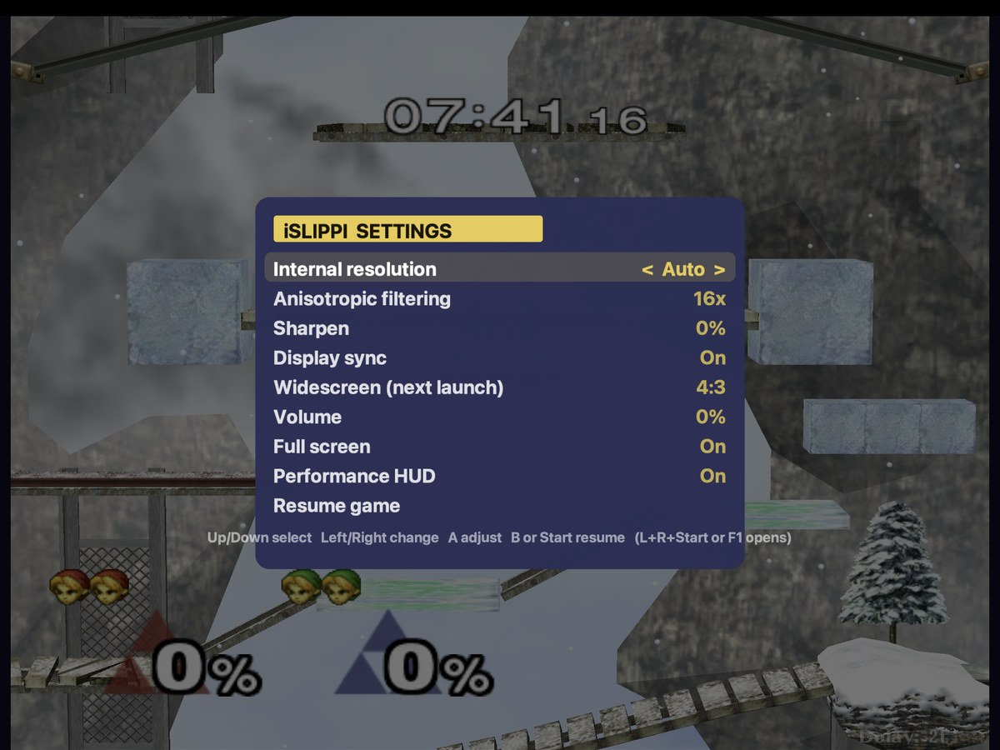
<br><sub>The in-game menu over a match on macOS; the game underneath receives neutral inputs until you resume.</sub>
</div>

### Controls

The default keyboard layout; every key can be changed.

| GameCube | Keyboard |
|---|---|
| Control stick | Arrow keys |
| C-stick | I J K L |
| A / B / X / Y | Z / X / C / V |
| L / R / Z | Q / W / E |
| D-pad | T F G H |
| Start | Return |
| Walk / tilt modifier (hold) | Left Shift |

Any controller SDL recognises works out of the box, over Bluetooth or a cable: PlayStation, Xbox, Switch Pro, MFi and most USB pads. Ports and button mappings are managed from the Controllers card on the dashboard, which also shows each controller's measured report rate (move a stick for a second and it settles).

**Configuring controls.** Every controller, and the keyboard, has a Configure button on the dashboard. It opens a live GameCube controller: whatever you press lights up, the sticks follow your thumbs inside their deadzone rings, and the triggers fill as you squeeze. Click a button on the picture or in the list and press the input you want, or use Map all to go through every control in order. Per controller you also set the stick and C-stick deadzones, the trigger press point (how far an analog trigger travels before it also counts as a digital L or R press), rumble, and swapped sticks. The keyboard maps the twelve buttons, both sticks' four directions and a walk/tilt modifier key with its stick amount. The same settings are in the in-game menu under Controls, including a step-by-step remap you can run without leaving the game. Everything is saved per controller.

<div align="center">
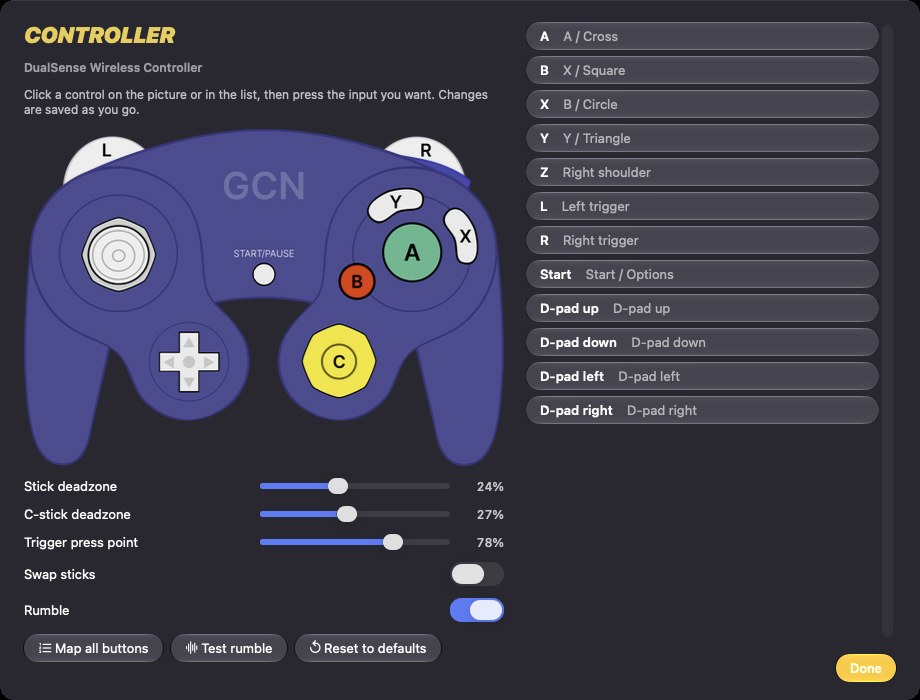
&nbsp;&nbsp;
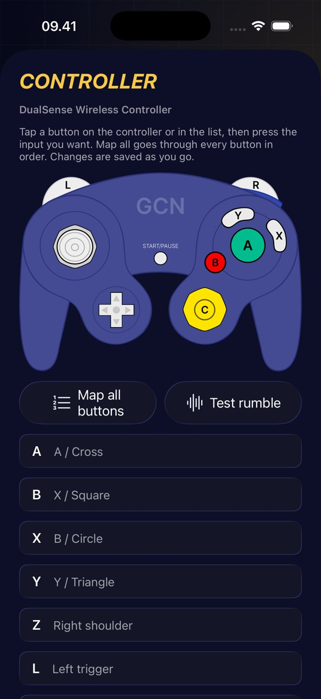
<br><sub>The controller editor for a Bluetooth pad on the Mac and on iPhone. The controller picture is ControllerOverlays' GameCube controller by Kat21.</sub>
</div>

**Connecting a controller.** Press Connect a Controller on the dashboard. Pick PlayStation, Xbox, Switch Pro or Other to see how that controller enters pairing mode, open Bluetooth settings from the same screen, and the screen confirms the moment the controller arrives. Apple does not let apps pair Bluetooth controllers themselves, so the pairing step happens in System Settings or Settings; it is only needed once per controller. USB and USB-C controllers need no pairing, and a GameCube adapter on the Mac is read directly.

<div align="center">
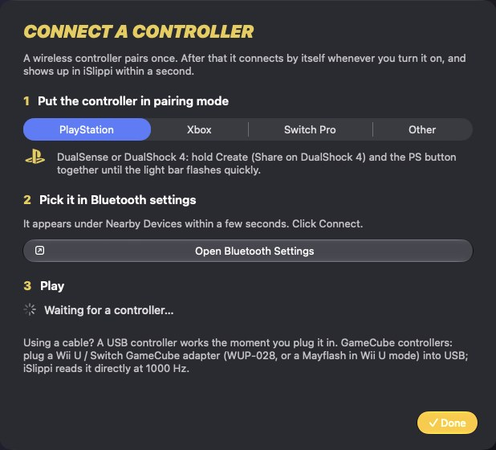
&nbsp;&nbsp;
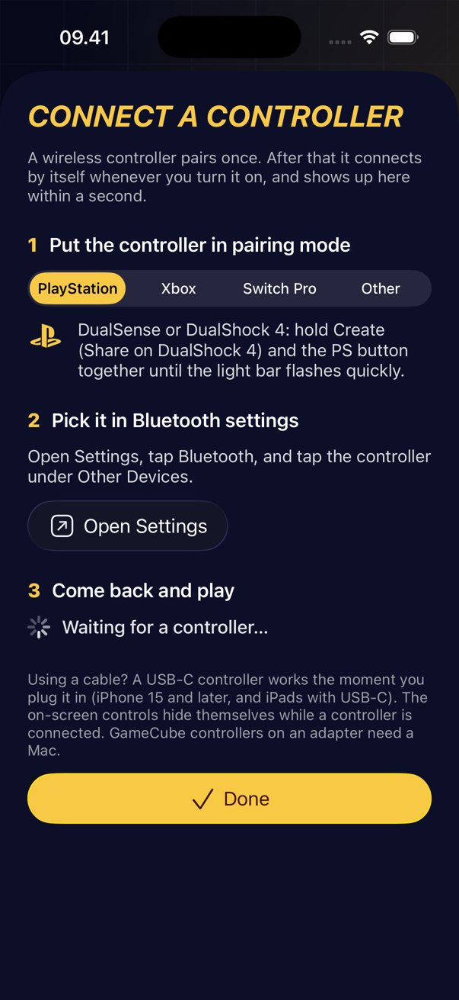
<br><sub>Connect a Controller on the Mac and on iPhone.</sub>
</div>

### GameCube controllers and the adapter (macOS)

This is how Slippi players connect a real GameCube controller everywhere: the Nintendo Wii U / Switch GameCube Controller Adapter (WUP-028), or a Mayflash 4-port adapter with its switch in "Wii U" mode, plugged into USB (a USB-C to USB-A adapter or hub on a modern Mac). The app reads it directly, the way Dolphin's native adapter mode does, and it takes priority on the ports that have controllers plugged in.

The catch every competitive player knows: the adapter's USB descriptor asks for an 8 ms polling interval, 125 Hz, which adds up to 8 ms of input latency. On Linux the fix is a kernel module ([gcadapter-oc-kmod](https://github.com/HannesMann/gcadapter-oc-kmod)) that rewrites the interval to 1 ms; on Windows a WinUSB driver and a patched Dolphin; on macOS it used to need a kernel extension ([GCAdapterDriver](https://github.com/secretkeysio/GCAdapterDriver)) and, since Big Sur, [a Recovery-mode change to system security](https://github.com/project-slippi/Ishiiruka/wiki/Overclocking-Controllers-on-macOS-Big-Sur,-Monterey,-Ventura,-or-Sonoma). iSlippi does it in-process: it opens the adapter through IOKit and asks the USB host controller for a 1 ms interval with `SetPipePolicy`, no driver, no security change, no libusb. The dashboard shows the rate the port actually delivers, measured from the report stream; if it says 125 Hz, that USB port or hub refused the request and another one usually accepts it (the same advice the Slippi Mac FAQ gives). `MELEE_ADAPTER_INTERVAL_MS=2` asks for 500 Hz if an adapter drops inputs at 1000.

iPadOS and iOS do not give apps raw USB access, so the adapter is a Mac feature; on an iPhone or iPad a Bluetooth or USB-C pad is the way to play with a physical controller.

### iPhone and iPad (your own device)

iSlippi cannot be on the App Store or an EU marketplace: the app contains the translated game code, which
only you may have, from your own disc. It can be on your own device, and that is one command:

```bash
./setup.sh /path/to/melee.iso --device
```

That produces `dist/iSlippi.ipa`. Open it in [AltStore](https://altstore.io), [SideStore](https://sidestore.io)
or [Sideloadly](https://sideloadly.io), sign in with your Apple ID, and it installs (a free Apple ID re-signs
every 7 days; a paid developer account lasts a year). Copy your disc image into the app's folder in the Files
app, or from Finder (your device › Files › iSlippi).

Prefer USB and your own certificate? `./setup.sh /path/to/melee.iso --device --team auto` signs with the
Apple Development identity Xcode created for your Apple ID and installs on the connected device
(`--team <TEAMID>` to pick one; `--udid <id>` to pick the device). On the device turn on Settings › Privacy &
Security › Developer Mode and trust your certificate under Settings › General › VPN & Device Management.

### On iPhone

iSlippi runs on iPhone the same way as on iPad, with two phone-specific rules. The internal resolution is capped at 2× (1280×1056) because a phone has the least thermal headroom, and when iOS reports serious or critical heat the game drops to 2× and then 1× automatically so the frame rate holds instead of the resolution (the change is logged, and the cap lifts when the phone cools). Pro models run the 120 Hz display path (`CADisableMinimumFrameDurationOnPhone`); other models present at 60 Hz.

Controllers: iPhone 15 and later accept USB-C pads (PlayStation, Xbox, Switch Pro, MFi) through the GameController framework, and every model pairs them over Bluetooth. iOS decides the HID polling rate; the app cannot set 1000 Hz on a phone, but it measures what the connection delivers and shows it in the Controllers card, and it samples the latest state right before each game frame. A Lightning iPhone takes MFi controllers only. None of this has been measured on a physical phone yet, only in the Simulator, which runs on the Mac's GPU.

### On iPad, iPhone and Vision Pro

Touch controls appear automatically and fade away the moment a Bluetooth controller connects. They follow the on-screen controller design from [VirtualFriend](https://github.com/agg23/virtualfriend): a GameCube layout with an analog stick, the A/B/X/Y cluster, Z, a C-stick and triggers, with haptic feedback on every press and presses that slide between buttons. Hold the device upright and the game sits on top with the controls below; turn it sideways and they move to the sides.

<div align="center">
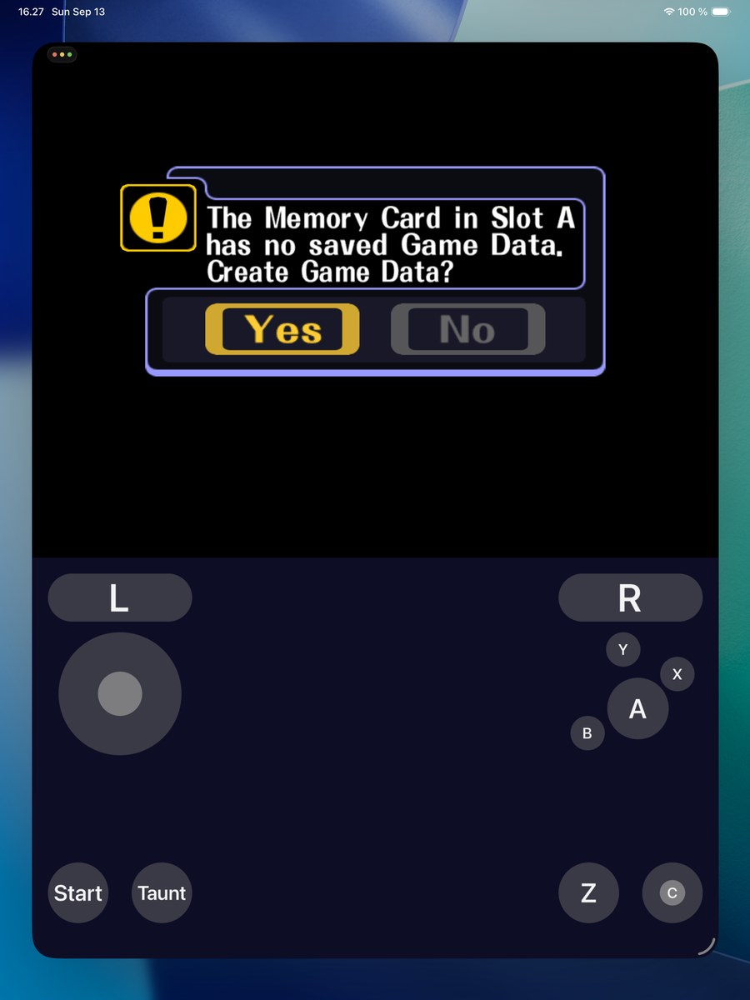
<br><sub>iPad Pro in the Simulator, native resolution, controls below the game.</sub>
</div>

### Discord Rich Presence (Mac)

Your Discord status follows the game, using the Discord application and artwork from the Slippi presence work ([slippi-rust-extensions #36](https://github.com/project-slippi/slippi-rust-extensions/pull/36)), built in, so there is nothing to set up:

| Moment | Discord shows |
|---|---|
| Menus | "Slippi Online · In menus" with your rank badge |
| Queue | "In queue - Ranked · Searching for an opponent", party 1 of 2 |
| Matched | "Opponent found · vs NAME" with their rank badge |
| In a game | The stage as the picture, your character as the badge, "Ranked - Game 2" and the live stock line "YOU 3 - 2 THEM", with a match timer |
| After a game | "Ranked - Game 2 - Set 1-1 · YOU vs THEM - Game over" |

Everyone who sees it gets a "Get Slippi" button and a "View Slippi Profile" link to your slippi.gg page. It talks to the Discord desktop app over its local socket: no login inside iSlippi, and nothing happens when Discord is not running. The Discord card on the dashboard turns it off or hides your rank. Menus, queue and opponent come from matchmaking; stage, characters, stocks and set score come from the replay event stream, never from game memory.

### Matchmaking region

Slippi's matchmaking places you by the region of your public IPv4 address, using [ipgeolocation.io](https://ipgeolocation.io). If that database has your address in the wrong place you get matched far from home. The dashboard's Matchmaking region card shows the IPv4 address the servers see, opens [ipgeolocation.io/what-is-my-ip](https://ipgeolocation.io/what-is-my-ip/) to check where it lands (make sure the page uses the IPv4, the one with dots), and copies a ready-to-send correction request for [their contact form](https://ipgeolocation.io/contact.html) with your address filled in.

### Notifications, and what Slippi's servers can and cannot do

There are no game invites in Slippi. The matchmaking server takes a ticket (`create-ticket` with your uid, play key, connect code, mode and, for Direct, the friend's code) and pairs it with a matching ticket; nobody is notified that a friend is looking for them, and the launcher's "notifications" are in-app toasts. The GraphQL API exposes your profile, ranked stats, chat messages and a few mutations, no presence, friends or subscriptions. So real push invites cannot be built on top of Slippi, and iSlippi does not pretend to. What it does: on the Mac, when a match is found while the app is not in front, it posts a system notification ("Match found: vs NAME (CODE), Ranked") so you can tab back in time. On iPhone and iPad the game cannot keep searching in the background, so there is nothing to notify.

### Built for the hardware

Slippi is competitive, so the app uses what Apple devices offer for latency:

| | |
|---|---|
| **ProMotion / variable refresh** | The game simulates at 60 Hz (rollback depends on it); every finished frame is shown on the very next refresh of a 120 Hz display instead of waiting for a 60 Hz slot, up to 8 ms sooner. Double-buffered swapchain, iPhone 120 Hz opt-in. |
| **Game Mode** | Declared as a game, so macOS and iOS give it CPU/GPU priority and cut Bluetooth controller latency in full screen. |
| **Performance cores, real time** | The simulation, render and GameCube-adapter threads run at user-interactive QoS on Apple silicon; the simulation and render threads also hold a Mach time-constraint (real-time) policy with a 16.7 ms period. |
| **No throttling while playing** | A latency-critical `NSProcessInfo` activity on macOS (no timer coalescing, no App Nap, no display or system sleep) and a disabled idle timer on iOS; `GCSupportsGameMode` so Game Mode engages; thermal-state changes are logged next to the frame timings and shown on the dashboard. |
| **Unified memory used properly** | Vertex, index and constant rings are shared, write-combined buffers (the CPU streams into them without polluting its cache); game textures live in private storage in the GPU's optimal layout, uploaded by blit from write-combined staging ahead of the frame. Guest RAM is prefaulted at boot; disc reads use a 1 MB buffer with kernel read-ahead. |
| **Wi-Fi traffic class** | Netplay and matchmaking sockets use the voice service class, the lowest-latency Wi-Fi queue. |
| **Controllers** | GameCube adapter (WUP-028) over USB on macOS, polled at 1000 Hz through IOKit without a driver; any Bluetooth or MFi pad with rumble, keyboard, and touch with haptics. Ports and mappings per controller; measured report rates on the dashboard. |
| **Input sampled at the last moment** | Controller and keyboard events are read right before the game's frame starts, after the frame sleep, not before it. A Bluetooth pad press no longer waits out the frame's slack (up to 12 ms) before the game sees it; the GameCube adapter already had its own 1 ms thread. |
| **Audio kept short** | A 256-frame CoreAudio buffer plus a 20 ms ring: about 26 ms from the game producing a sound to the speaker, measured underrun-free. `MELEE_AUDIO_SLACK_MS` and `MELEE_AUDIO_FRAMES` adjust it; underruns are logged as they happen. |
| **Internal resolution is the latency knob** | Measured in full screen on an M5 Pro: 1× costs 1.8 ms of GPU and 4 ms XFB-to-panel, 2× 2.6 ms and 4.6 ms, 4× 4.6 ms and about 7 ms. Anisotropic filtering is free. The competitive preset picks 2×. |
| **Shaders tuned for Apple GPUs** | The GameCube's integer colour combiners are emulated exactly; the surrounding float math compiles with Metal fast math (26% less GPU time, pixel-identical on deterministic captures). |
| **Measured latency** | With the game's own instrumentation (`MELEE_METAL_LATENCY=1` logs XFB-copy-to-panel time from Metal's presented timestamps): about 10 ms in full screen on a 120 Hz MacBook Pro, about 25 ms in a window, because a window costs one compositor frame. Full screen is the default; ⌥⏎ toggles. The simulation itself takes about 4 ms of each 16.7 ms frame on an M5 Pro, GPU work 5–8 ms, render encoding about 1 ms. |
| **Render thread** | The simulation hands each frame to a queue and never waits for the GPU or the display. Measured on a ProMotion MacBook Pro: Metal's `nextDrawable` can block for 15–30 ms when the display pipeline holds both drawables, and with rendering on the game thread that was a dropped game frame every time (up to 80 late frames a minute). With the render thread: zero late frames in a minute of play, and the stall costs only a shown frame. |
| **Shaders never stall the game** | The first time a stage, character or effect is seen its Metal pipeline is compiled in the background and the draw is skipped for a frame or two instead of freezing the game (28 new shaders once cost 742 ms on the render path). Every pipeline ever used is written to `pipelines.bin` in the cache folder and compiled again at the next launch while the game boots, so a stage seen once never even flickers. |
| **Real-time simulation thread** | The simulation thread asks the kernel for a time-constraint (real-time) policy with a 16.7 ms period, so background work cannot push a frame past its deadline. `MELEE_REALTIME=0` turns it off. |
| **Honest about refresh** | The game is a 60 Hz simulation and Slippi rollback depends on it staying that way; a 120 Hz display shortens the wait between a finished frame and the pixels, it does not double the frame rate. The dashboard shows the display's real maximum. |
| **Metal** | Native renderer at integer multiples of the original resolution, supersampling, anisotropic filtering, contrast-adaptive sharpening. |

## Where it stands

| | Status |
|---|---|
| Boot, menus, offline VS matches | ✅ Working |
| Slippi Online: login, matchmaking, rollback, replays | ✅ Working — verified with two local instances staying in sync for a full game |
| Audio, keyboard, gamepads, GameCube adapter | ✅ Working |
| Memory card saves (`.gci` folder) | ✅ Working |
| Rendering | ✅ Native Metal renderer with the same Dolphin-derived shader pipeline as the Windows build, integer internal resolution up to 16× plus supersampling, 120 Hz-ready presentation |
| Native Slippi sign-in (no Slippi Launcher needed) | ✅ Working — Firebase email/password, play key from Slippi's backend |
| iPad / iPhone | ✅ Boots and renders at native resolution in the Simulator with touch controls, launcher and disc import; not yet run on a physical device |
| Apple Vision Pro | 🟡 Builds for the visionOS Simulator; no visionOS runtime is installed here yet, so untested |

This is an alpha. Expect rough edges, and please report them.

<div align="center">
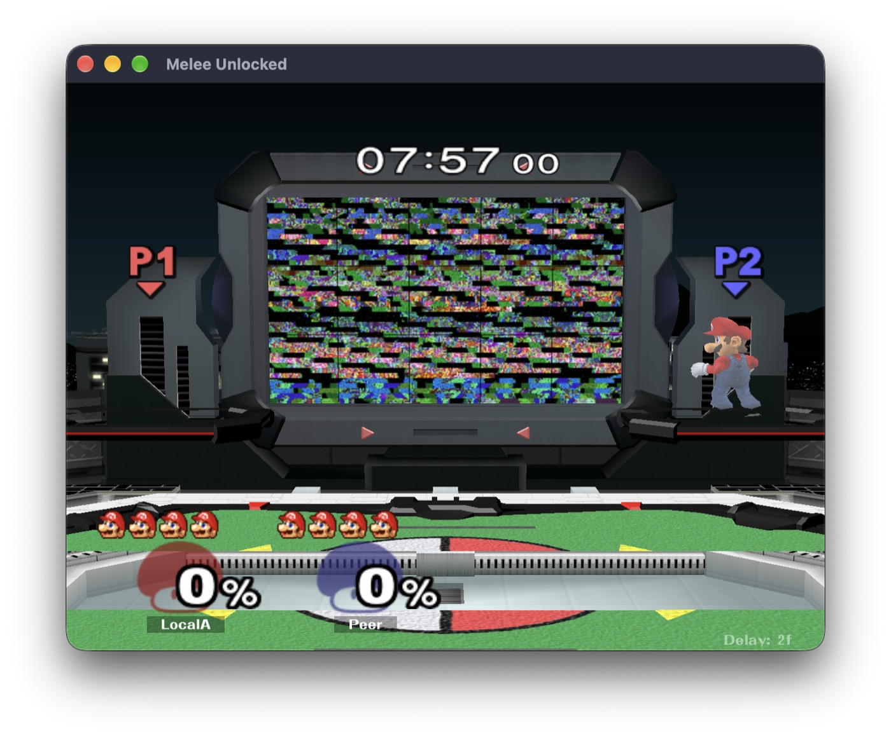&nbsp;
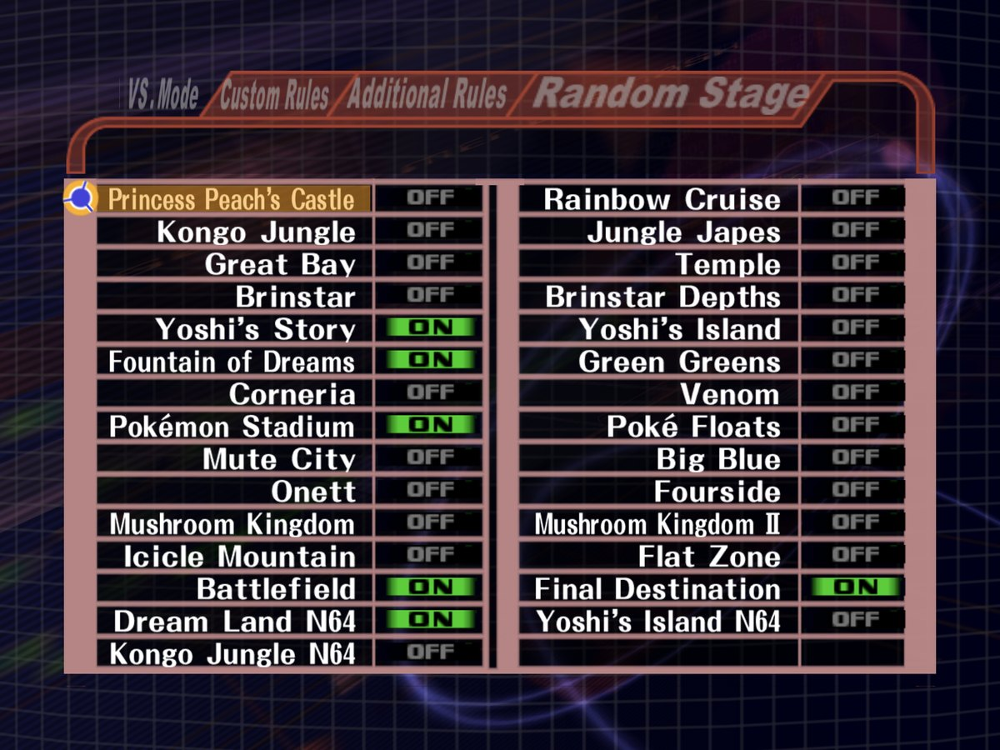
<br><sub>Left: two instances of the app in an online match against each other on one Mac. Right: Corneria at 4× resolution.</sub>
</div>

## How it works

1. **Translate.** `port/recomp` reads your disc's executable and Slippi's Gecko code tables and writes one C++ function per game function. Apple Clang compiles them into a static library. This step runs on your machine; nothing from the game is ever committed here.
2. **Run.** `port/runtime` is the host: guest memory, the GameCube SDK services the game expects (disc, controllers, audio DSP, memory cards), and the Slippi EXI device that Slippi's code talks to.
3. **Draw.** The game's GX commands are decoded into draw calls and rendered by a native Metal backend (`port/runtime/gx/gx_metal.mm`) with shaders generated the way Dolphin generates them, so what you see matches the Windows build.
4. **Connect.** `slippi_net` and `slippi_online` are wire-compatible ports of Slippi Dolphin's netplay client, matchmaking and reporting.

## Build from source

`./setup.sh` does all of the below. The manual steps, for people who want to see them:

Requirements: Xcode Command Line Tools, Homebrew (`cmake ninja python`), a checkout of [doldecomp/melee](https://github.com/doldecomp/melee) for the animation helpers, and your disc's `main.dol`. (libusb is no longer needed: the GameCube adapter is read through IOKit.)

```bash
git clone https://github.com/TheAndersMadsen/islippi.git
cd islippi
tools/bootstrap_aurora.sh
python3 tools/bootstrap_port.py --decomp-root /path/to/doldecomp-melee \
  --dol /path/to/main.dol --build-dir build/mac --gct-base 0x8065CC80 --macos-arch arm64 --stage generate
cmake -S . -B build/mac -G Ninja -DCMAKE_BUILD_TYPE=Release \
  -DMELEE_DECOMP_ROOT=/path/to/doldecomp-melee -DMELEE_DOL_PATH=/path/to/main.dol \
  -DMELEE_PORT_GENERATED_DIR=$PWD/build/mac/generated/guest \
  -DCMAKE_EXPORT_COMPILE_COMMANDS=ON -DMELEE_BUILD_PORT_TESTS=ON -DMELEE_BUILD_PORT_HEADLESS=ON -DMELEE_BUILD_PORT_METAL=ON
cmake --build build/mac --target melee_port_mac --parallel
tools/package_macos_app.sh build/mac dist
open dist/iSlippi.app
```

### iPad, iPhone and Vision Pro

The same tree builds the device apps with a full Xcode install. For the iPad Simulator:

```bash
export DEVELOPER_DIR=/Applications/Xcode.app/Contents/Developer
python3 tools/bootstrap_port.py --decomp-root /path/to/doldecomp-melee \
  --dol /path/to/main.dol --build-dir build/ios-sim --gct-base 0x8065CC80 --macos-arch arm64 --stage generate
cmake -S . -B build/ios-sim -G Ninja -DCMAKE_BUILD_TYPE=Release -DCMAKE_EXPORT_COMPILE_COMMANDS=ON \
  -DCMAKE_SYSTEM_NAME=iOS -DCMAKE_OSX_ARCHITECTURES=arm64 -DCMAKE_OSX_SYSROOT=iphonesimulator -DCMAKE_OSX_DEPLOYMENT_TARGET=17.0 \
  -DMELEE_DECOMP_ROOT=/path/to/doldecomp-melee -DMELEE_DOL_PATH=/path/to/main.dol \
  -DMELEE_PORT_GENERATED_DIR=$PWD/build/ios-sim/generated/guest \
  -DMELEE_BUILD_PORT_TESTS=OFF -DMELEE_BUILD_PORT_HEADLESS=OFF -DMELEE_BUILD_PORT_METAL=ON
cmake --build build/ios-sim --target melee_port_mac --parallel
xcrun simctl install booted build/ios-sim/port/iSlippi.app
```

Use `-DCMAKE_OSX_SYSROOT=iphoneos` for a device (sign the bundle with your team) and `-DCMAKE_SYSTEM_NAME=visionOS -DCMAKE_OSX_SYSROOT=xrsimulator -DCMAKE_OSX_DEPLOYMENT_TARGET=1.0` for the Vision Pro Simulator.

`melee_port_mac --help` lists every option (window size, volume, input delay, explicit disc or Slippi folder). `melee_port_metal` and `melee_port_headless` are offline diagnostic executables used by the test suite. Developer notes live in [docs/](.): [PERFORMANCE.md](PERFORMANCE.md) explains every log signal and the measurement scripts, and [CLAUDE.md](../CLAUDE.md) is the agent and contributor guide.

## Releases

There are no public downloads, and there must not be: the built app contains the translated game, so a
`.dmg` or `.ipa` on a public Releases page would hand Nintendo's code to everyone (and go against the
Slippi team's wishes). What exists instead:

- `tools/release.sh /path/to/melee.iso` builds `dist/iSlippi-<version>.dmg`, `dist/iSlippi-<version>.ipa`,
  checksums and release notes (generated from the commits since the last tag, in player terms) on your
  Mac. Add `--publish` to create a **draft** GitHub release with them; the script refuses unless the
  repository is private.
- `.github/workflows/release.yml` does the same on a `macos-26` runner for a **private fork**: upload your
  `main.dol` once as the asset of a release tagged `inputs` (`gh release create inputs main.dol`), then
  push a `v*` tag matching `VERSION`. It refuses to run on a public repository.

## Windows

The upstream project, [Hero88go/melee-unlocked](https://github.com/Hero88go/melee-unlocked), is the Windows build with D3D12, DLSS and an unlocked display rate. This repository tracks it and adds the Apple platforms.

## Credits and legal

The GameCube controller in the controller editors is the indigo controller from [ControllerOverlays](https://github.com/datkat21/ControllerOverlays) by Kat21, GPL-3.0 (see `port/app/art/controller/README.md`); builds that include it are distributed under GPL-3.0, which the project's GPL-2.0-or-later licence allows. The app icon and the dashboard mark use the Slippi logo from the [Slippi Launcher](https://github.com/project-slippi/slippi-launcher) (GPL-3.0). Slippi is a trademark of its authors; this is a community project and the logo is used to identify what the app connects to, not to claim affiliation. Design references: [dimillian/Skills](https://github.com/dimillian/Skills) (Liquid Glass, controls, haptics and review checklists), Apple's Liquid Glass documentation as collected in [xcode-27-system-prompts](https://github.com/artemnovichkov/xcode-27-system-prompts), and [PwrGit](https://github.com/pwrdrvr/PwrGit/pull/196) for the Icon Composer bundle layout.

Built on the work of the [Slippi](https://slippi.gg) team, the [Dolphin](https://dolphin-emu.org) project, [SDL](https://libsdl.org), [Aurora](https://github.com/encounter/aurora) (build tooling and the diagnostic renderer), the [doldecomp/melee](https://github.com/doldecomp/melee) contributors, and [Hero88go/melee-unlocked](https://github.com/Hero88go/melee-unlocked). This project is not affiliated with or endorsed by the Slippi team, Nintendo or HAL Laboratory.

GPL-2.0-or-later. Super Smash Bros. Melee is the property of Nintendo and HAL Laboratory. This repository contains no game data; you must supply your own legally obtained disc image.
